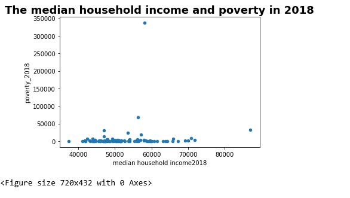
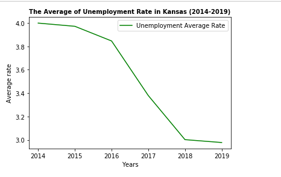

## About me
A background in information science. Experience in Data Analytics from a Bootcamp at the University of Kansas with skills in VBA scripting, Pandas, Python, and SQL. 
Passionate about data analytics ability to create stories using data and graphs to understand relationships between many variables. Flexible, organized in addition these experiences helped me to advance my skills in problem-solving, troubleshooting, communication, collaboration and time management. This proficiency combined with my experience with problem solving and presenting solutions allows me to contribute to any team.

_______________________________

## Projects 

Visit..
[Evection Predection](https://mercygriffin.github.io/EvictionPrediction/dashboard.html)

-------------------------------

## Projects

Visit

[Unempoyled in Kansas]()

____________

## Education
### Certificate Data Analytics, University of Kansas
A 24-week intensive program focused on gaining technical programming skills in Excel, VBA, Python, JavaScript, SQL Databases, Tableau, Big Data, and Machine Learning
  

### Bachelor information Science 

---

## Technical Skills
Languages: Python • SQL • VBA Scripting • JavaScript 
Data Visualizations: Tableau • D3.js • Plot.ly • Matplotlib • HTML • CSS • Dashboarding • Geomapping with Leaflet.js
Excel: VBA • Macros • Pivot Tables •Index/Match VLOOKUP
SQL: PostgreSQL • MongoDB
Python: Pandas • NumPy • SciPy • SQLAlchemy • Jupyter Notebook

---

### Additonal Projects

- [HerosPandas_Project](https://github.com/areejhum/HerosPandas_Project)
- [Python-CitySchools-Project](https://github.com/areejhum/Python-CitySchools-Project)
- [Bank-and-Election-analysis](https://github.com/areejhum/Bank-and-Election-analysis)
- [Web-Design-Challenge](https://github.com/areejhum/Web-Design-Challenge)
- [leaflet-challenge](https://github.com/areejhum/leaflet-challenge/tree/master/Leaflet-Step-1)
- 
- 

