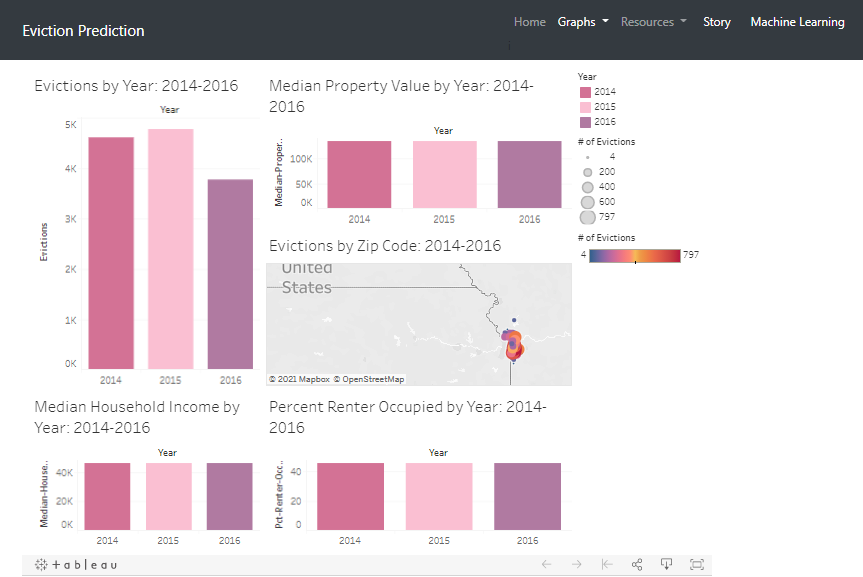

## About me
background in information science.  Experience in Data Analytics from a Bootcamp at the University of Kansas with skills in VBA scripting, Pandas, Python, and SQL.
Passionate about data analytics ability to create stories using data and graphs to understand relationships between many variables.
Advanced skills in problem-solving, troubleshooting, communication, collaboration, and time management.

_______________________________

## Projects 

## Vist
[Evection Predection](https://mercygriffin.github.io/EvictionPrediction/dashboard.html)

